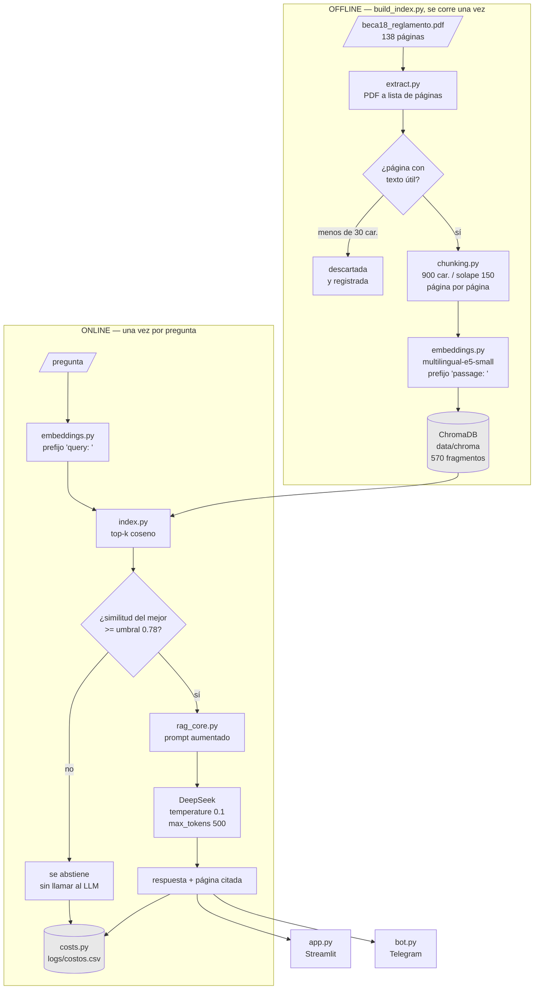

# Chatbot normativo Beca 18 — RAG con embeddings locales y DeepSeek

Sistema de preguntas y respuestas sobre la **Resolución Directoral Ejecutiva N.° 033-2026-MINEDU/VMGI-PRONABEC** (Reglamento de Beca 18 y Becas Especiales, Convocatoria 2026).

Responde únicamente con lo que dice el documento, cita la página, y se abstiene cuando la respuesta no está en el corpus.

Material del curso **Data Science con Python**, Universidad del Pacífico, 2026-II.

---

## El pipeline



**Regla de arquitectura:** `src/rag_core.py` no importa `streamlit` ni nada de Telegram. Las interfaces son intercambiables. Se verifica con una línea:

```bash
grep -nE "^\s*(import|from)\s+(streamlit|telegram)" src/rag_core.py   # debe salir vacío
```

---

## Instalación

```bash
git clone <tu-repo> && cd beca18-rag
python -m venv .venv && source .venv/bin/activate   # Windows: .venv\Scripts\activate
pip install -r requirements.txt
cp .env.example .env        # pon tu DEEPSEEK_API_KEY y tu TELEGRAM_BOT_TOKEN
```

## Uso

```bash
python build_index.py          # una vez: construye el índice (decenas de segundos)
streamlit run app.py           # interfaz web local
python bot.py                  # bot de Telegram (en otra terminal)
python eval/run_eval.py        # Recall@1, @3, @5 — gratis, sin API
python eval/run_eval.py --generar   # además prueba la abstención (consume API)
python -m src.costs            # reporte del histórico de costos
```

---

## Decisiones técnicas y el número que las respalda

| Decisión | Alternativa descartada | Evidencia |
|---|---|---|
| Página en **metadata**, no en el texto | marcador `[PAGE N]` dentro del texto | con el marcador en texto, solo **9.3%** de los fragmentos podía citar su página; con metadata, **100%** |
| Embeddings **locales** | `gemini-embedding-001` por API | indexar 1,483 fragmentos exigía 30 lotes con `sleep(30)`: más de **15 minutos** solo de esperas, contra decenas de segundos en CPU y costo cero |
| Chunk de **900** caracteres | 400 del notebook original | un artículo del reglamento suele superar los 400 caracteres; se verifica con `run_eval.py` comparando Recall@3 |
| **Umbral de similitud** antes de llamar al LLM | llamar siempre | si nada se parece, no hay contexto que fundamente una respuesta; abstenerse es correcto y además no se paga la llamada |
| `temperature = 0.1` y `max_tokens = 500` | valores por defecto | un chatbot normativo no puede dar respuestas distintas a la misma pregunta, y sin techo de salida no hay techo de gasto |
| **Prefijos** `query:` / `passage:` | codificar todo igual | recupera el comportamiento asimétrico que daba `task_type` en Gemini |

---

## Costo

Con `deepseek-flash` y precios verificados el 2026-09-14 (`https://api-docs.deepseek.com/quick_start/pricing`):

| Estrategia | Tokens de entrada | USD por pregunta |
|---|---:|---:|
| Mandar el reglamento completo | ~124,000 | ~0.0188 |
| RAG con k=5 | ~900 | ~0.00032 |

Aproximadamente **60 veces más barato**, sobre el mismo documento.

DeepSeek aplica tarifa punta y fuera de punta desde el 16-08-2026; la punta cuesta el doble. Los precios de `config.yaml` llevan campo `verificado_el`: un precio sin fecha no es auditable.

---

## Estructura

```
├── config.yaml            todos los parámetros, sin valores en el código
├── build_index.py         proceso offline
├── app.py                 adaptador Streamlit
├── bot.py                 adaptador Telegram (polling)
├── src/
│   ├── settings.py        configuración y credenciales
│   ├── extract.py         PDF a páginas
│   ├── chunking.py        páginas a fragmentos con metadata
│   ├── embeddings.py      modelo local con prefijos asimétricos
│   ├── index.py           ChromaDB: indexar y buscar
│   ├── costs.py           contabilidad de tokens y USD
│   └── rag_core.py        el motor: responder(pregunta, k)
├── eval/
│   ├── preguntas.csv      6 de dominio + 4 fuera de dominio
│   └── run_eval.py        Recall@k y tasa de abstención
├── data/                  PDF y el índice (el índice no se commitea)
└── logs/costos.csv        una fila por llamada
```
